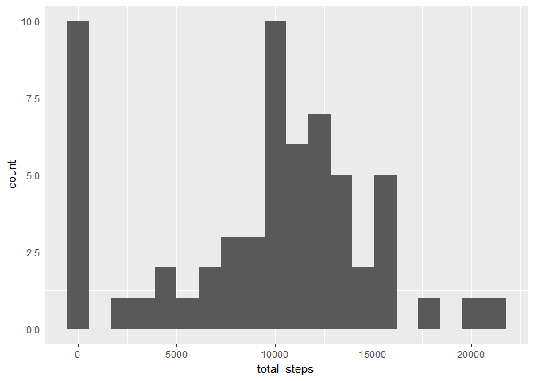
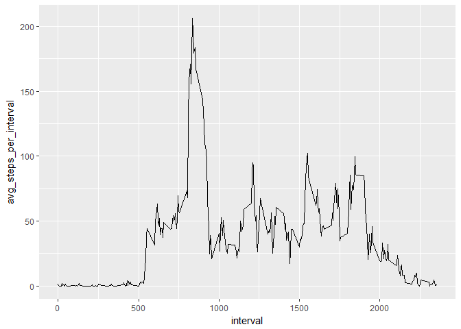
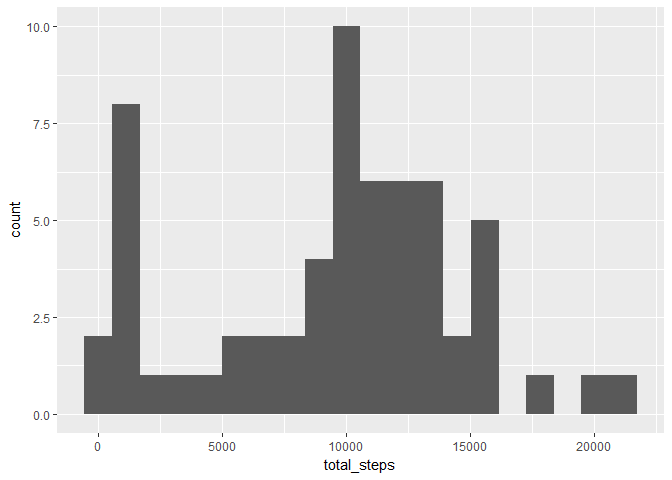
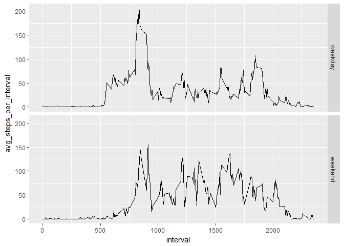

# Introduction 
It is now possible to collect a large amount of data about personal movement 
using activity monitoring devices such as a Fitbit, Nike Fuelband, or Jawbone Up.
These type of devices are part of the "quantified self" movement - a group of 
enthusiasts who take measurements about themselves regularly to improve their 
health, to find patterns in their behavior, or because they are tech geeks. But 
these data remain under-utilized both because the raw data are hard to obtain 
and there is a lack of statistical methods and software for processing and 
interpreting the data.

This assignment makes use of data from a personal activity monitoring device. 
This device collects data at 5 minute intervals through out the day. The data 
consists of two months of data from an anonymous individual collected during the
months of October and November, 2012 and include the number of steps taken in 5 
minute intervals each day.

## Loading and processing the data:


```r
# First load all necessary packages
library(readr)
library(dplyr)
```

```
## Warning: package 'dplyr' was built under R version 3.4.3
```

```
## 
## Attaching package: 'dplyr'
```

```
## The following objects are masked from 'package:stats':
## 
##     filter, lag
```

```
## The following objects are masked from 'package:base':
## 
##     intersect, setdiff, setequal, union
```

```r
library(ggplot2)
```

```
## Warning: package 'ggplot2' was built under R version 3.4.3
```

```r
# The csv file is located in the working directory
data <- read_csv("activity.csv") 
```

```
## Parsed with column specification:
## cols(
##   steps = col_integer(),
##   date = col_date(format = ""),
##   interval = col_integer()
## )
```

## What is the mean total number of steps taken per day?

Note: for this part we ignore missing values in the dataset

1. Calculate the total number of steps taken per day


```r
data2 <- data %>%
        group_by(date) %>%
        summarize(total_steps = sum(steps, na.rm = T)) %>%
        print()
```

```
## # A tibble: 61 x 2
##    date       total_steps
##    <date>           <int>
##  1 2012-10-01           0
##  2 2012-10-02         126
##  3 2012-10-03       11352
##  4 2012-10-04       12116
##  5 2012-10-05       13294
##  6 2012-10-06       15420
##  7 2012-10-07       11015
##  8 2012-10-08           0
##  9 2012-10-09       12811
## 10 2012-10-10        9900
## # ... with 51 more rows
```

2. Make a histogram of the total number of steps taken each day


```r
ggplot(data2, aes(x = total_steps)) +
        geom_histogram(bins = 20)
```

<!-- -->

3. Caclulate/report the mean/median of the total number of steps taken each day


```r
summarize(data2, 
          mean_steps_per_day = mean(total_steps, na.rm = T),
          median_steps_per_day = median(total_steps, na.rm = T))
```

```
## # A tibble: 1 x 2
##   mean_steps_per_day median_steps_per_day
##                <dbl>                <int>
## 1               9354                10395
```

## What is the average daily activity pattern?

1. Make a time series plot of the 5 minute interval (x-axis) and the average 
number of steps taken, averaged across all days (y-axis)


```r
data3 <- data %>%
        group_by(interval) %>%
        summarize(avg_steps_per_interval = mean(steps, na.rm = T),
                  median_steps_per_interval = median(steps, na.rm = T))

ggplot(data3, aes(x = interval, y = avg_steps_per_interval)) +
        geom_line()
```

<!-- -->

2. Which 5 minute interval, on average across all days, contains the maximum
number of steps?


```r
index <- which.max(data3$avg_steps_per_interval)
data3$interval[index]
```

```
## [1] 835
```

```r
rm(index)
```

## Imputing missing values

Note: there are a number of days/intervals where there are missing values 
(coded as NA). The presence of missing days may introduce bias into some 
calculations or summaries of the data

1. Calculate and report the total number of missing values in the dataset 
(i.e. the total number of rows with NAs)


```r
sum(is.na(data$steps))
```

```
## [1] 2304
```

2. Devise a strategy for filling in all of the missing values in the dataset

We will use the median from each 5 minute interval (which we calculated earlier)
to replace each NA

3. Create a new dataset that is equal to the original but with the missing data
filled in


```r
# We will complete both steps below. First we initialize a new dataframe from 
# the original
imputed_data <- data
# Create a new column with the median steps per interval (over all days)
imputed_data$median_steps_per_interval <- data3$median_steps_per_interval
# Find the index for which columns have NAs
index <- which(is.na(imputed_data$steps))
# Replace those NAs with the median data
imputed_data$steps[index] <- imputed_data$median_steps_per_interval[index]
rm(index)
```


4. (a) Make a histogram of the total number of steps taken each day

```r
imputed_data2 <- imputed_data %>% group_by(date) %>%
        summarize(total_steps = sum(steps)) 

ggplot(imputed_data2, aes(x = total_steps)) + geom_histogram(bins = 20)
```

<!-- -->

4. (b) Calculate/report the mean and median total number of steps taken per day.
Do these values differ from the estimates from the first part of the assignment?
What is the impact of imputing missing data on the estimates of the total daily 
number of steps?

```r
summarize(imputed_data2, 
          mean = mean(total_steps),
          median = median(total_steps))
```

```
## # A tibble: 1 x 2
##    mean median
##   <dbl>  <int>
## 1  9504  10395
```

The median remained the same, while the mean increased. 

## Are there differences in activity patterns between weekdays and weekends?

Note: for this part we use the imputed data from the previous questions

1. Create a new factor variable in the dataset with two levels - "weekday" and 
"weekend" indicating whether a given date is a weekday or weekend day


```r
imputed_data$day <- ifelse(weekdays(imputed_data$date) %in% c("Saturday", 
                                                              "Sunday"), 
                           "weekend", "weekday")

imputed_data$day <- as.factor(imputed_data$day)

head(imputed_data)
```

```
## # A tibble: 6 x 5
##   steps date       interval median_steps_per_interval day    
##   <int> <date>        <int>                     <int> <fct>  
## 1     0 2012-10-01        0                         0 weekday
## 2     0 2012-10-01        5                         0 weekday
## 3     0 2012-10-01       10                         0 weekday
## 4     0 2012-10-01       15                         0 weekday
## 5     0 2012-10-01       20                         0 weekday
## 6     0 2012-10-01       25                         0 weekday
```

2. Make a panel plot containing a time series plot of the 5-minute interval 
(x-axis) and the average number of steps taken, averaged across all weekday days
or weekend days (y-axis)


```r
imputed_data3 <- imputed_data %>%
        group_by(interval, day) %>%
        summarize(avg_steps_per_interval = mean(steps))

ggplot(imputed_data3, aes(x = interval, y = avg_steps_per_interval)) +
        geom_line() +
        facet_grid(day ~.) 
```

<!-- -->

